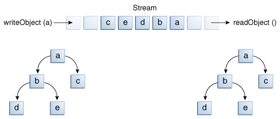

# I/O Streams

An I/O Stream represents an input source or an output destination
A stream is a sequence of data

## Byte Streams
- Programs use byte streams to perform input and output of 8-bit bytes.
- All byte stream classes are descended from InputStream and OutputStream.


# 📘 Java I/O Streams Notes

A structured summary of Java Input/Output (I/O) Streams, useful for quick revision and reference.

---

## 🔸 Overview

An I/O Stream represents an input source or an output destination <br>
A stream is a sequence of data<br>

Java I/O streams are used to perform reading and writing operations on data (files, network, etc.). They are categorized into:<br>

- **Byte Streams** – handle raw binary data.
- **Character Streams** – handle character/text data.

---

## 📂 Hierarchical Structure of I/O Streams

### 🔹 Byte Streams

#### InputStream (abstract class)
- `FileInputStream`
- `BufferedInputStream`
- `ByteArrayInputStream`
- `ObjectInputStream`
- `FilterInputStream`
-  `DataInputStream`

#### OutputStream (abstract class)
- `FileOutputStream`
- `BufferedOutputStream`
- `ByteArrayOutputStream`
- `ObjectOutputStream`
- `PrintStream`
- `FilterOutputStream`
- `DataOutputStream`

### 🔹 Character Streams

#### Reader (abstract class)
- `FileReader`
- `BufferedReader`
- `CharArrayReader`
- `StringReader`
- `InputStreamReader`

#### Writer (abstract class)
- `FileWriter`
- `BufferedWriter`
- `CharArrayWriter`
- `StringWriter`
- `OutputStreamWriter`
- `PrintWriter`

---

## 📌 Sample Code Snippets

### ✅ Reading a File using `BufferedReader`

```java
BufferedReader reader = new BufferedReader(new FileReader("file.txt"));
String line;
while ((line = reader.readLine()) != null) {
    System.out.println(line);
}
reader.close();
```

### DataStreams
- support binary I/O of primitive data type values (boolean, char, byte, short, int, long, float, and double) as well as String values
- `NOTE:`
  - Detect EOF by catching the EOFException instead of testing for a invalid return value
* `Problem:`
  * Use floating point to represent the currency which cannot represent values like 0.1
     For which we have to use BigDecimal but it is an object which DataStream doesn't support

### ObjectStreams
- `ObjectInputStream` & `ObjectOuptutStream` are sub-classes of `DataInputStream` & `DataOutputStream`
- `writeObject()` method write all the sub-objects which are being referenced in an object. So that it
can reconstruct the original object by doing a readObject().
- In this image `a` is the actual object & `b,c,d,e` are the sub-objects required to construct `a`. Hence
all are written in the outputStream.


## NIO 2.0
java.nio.file package

### `Path`
- Path class is a programmatic representation of a path in the file system
- Relative Path: /src/i_o_streams
- Absolute Path: JavaBasics/src/i_o_streams
- Symbolic Links: special file that serves as a reference to another file
- In Solaris OS Path follows (/home/joe/foo) & in Windows OS it follows(C:\home\joe\foo)
- 